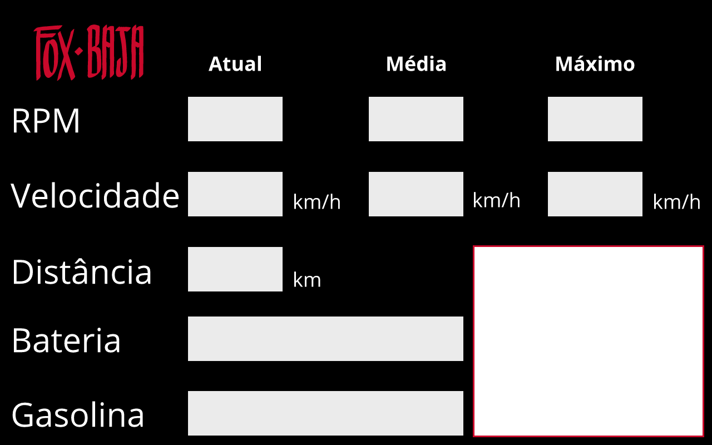

# IHM Box Fox Baja

## Sobre
O programa consiste na recepção de dados provenientes do carro Fox Baja via rádio frequência LoRa, sendo ingeridos no computador via porta serial. Os dados são mostrados para a equipe em tempo real, fornecendo uma média, valor máximo e a distância que o carro percorreu. Todos esses dados podem ser salvos em um arquivo *.csv* para futura análise.

## Instalação

Esse projeto utiliza [Python 3.7](http://python.org) no ambiente criado pelo Anaconda e a biblioteca de interface gráfica [PyQt5](https://pypi.org/project/PyQt5/), que pode ser instalada com:

```
$ conda install pyqt
```

O programa utiliza apenas uma biblioteca terceira, que pode ser instalada por meio de:
```
$ pip install pyserial
```

### Arquivo Python
Para rodar o programa, basta executar o arquivo `main.py`:
```
$ python main.py
```

Obs: Certifique-se que o comando python está se referenciando ao Python instalado pelo Anaconda, onde estão as bibliotecas do PyQt. Caso contrário, você poderá se deparar com o erro: ```ModuleNotFoundError: No module named 'PyQt5'```

### Programa executável
Para rodar o programa  executável, basta ir na pasta *App* e rodar *Application.exe*.

## Uso
Ao abrir o programa, o primeiro passo do usuário deve ser selecionar um dispositivo serial para a recepção dos dados. Isto é feito pelo menu: `Arquivo > Conectar`, que listará todos os dispositivos do tipo conectados ao computador.

Ao selecionar o dispositivo, o programa já começará mostrar os dados sendo recebidos. Para gravá-los, é preciso criar um *relatório*, por meio do menu `Arquivo > Iniciar` (ou pelo atalho Ctrl + N), que abrirá uma janela para o usuário escolher o local onde o arquivo deve ser gravado. 

Obs: O nome do arquivo **NÃO** deve conter a extensão do arquivo, o próprio programa já faz isso:
- Incorreto: *nacional_enduro.csv*
- Correto: *nacional_enduro*

Caso o arquivo seja salvo com o nome incorreto, será salvo como *nacional_enduro.csv.csv*, sendo necessário editá-lo para ser utilizável.

Para encerrar a gravação do arquivo, basta clicar no botão Para por meio do menu `Arquivo > Parar` (ou pelo atalho Ctrl + Q).

Para desconectar o dispositivo serial, basta clicar no botão Desconectar por meio do menu `Arquivo > Desconectar`. Podendo assim selecionar outro dispositivo.


## Como foi feito
### Interface
O design da interface foi feito no programa de vetores [Gravit](https://gravit.io/):


Essa imagem foi inserida no programa *PyQt Designer* como um plano de fundo e os componentes foram sobrepondo a imagem.

Para ver como esse processo acontece, abra o arquivo MainWindow.ui no PyQt Designer, digitando `designer` no console.


Para converter a interface gráfica feita na ferramenta *Designer* para um arquivo *.py*, é utilizado a seguinte linha de comando:

```
$ pyuic5 MainWindow.ui > MainWindow.py
```

### Programação
O comando `pyuic5` cria um arquivo *.py* que contém a classe *Ui_MainWindow*, que apresenta todos os objetos da interface, que poderemos utilizar. Não foi preciso mexer neste arquivo.

O arquivo *main.py* importa a classe *Ui_MainWindow*, possibilitando que seja possível acessar os atributos e métodos dela por meio da classe principar *MainWindow*.

Nesta classe, foram criados chamada de métodos e atributos para armazenar informações dentro do método *__init__*, que é chamado sempre que a classe é inicializada. 

#### Métodos importantes:
- **consolePrint(texto)**: adiciona a string passada como argumento em um item do QListWidget, que foi adaptado para servir de console da aplicação.

- **showSerialDevices()**: é chamada na inicialicação do programa. Lista todos os dispositivos seriais conectados no computador.

- **receiveData()**: é responsável por checar o buffer da porta serial, parsear as informações e checar se o pacote recebido tem tamanho 6 e o header **Fox**. Caso seja um pacote esperado pelo programa, os elementos são convertidos para *int*, é adicionado data e hora à lista e essa lista é enviada para o método *displayData*.

- **displayData(data)**: é responsável por fazer o cálculo do valor médio das informações, checar se algum valor obtido é um máximo, calcular a distância percorrida em relação a penúltima informação recebida e mandar esses dados para os componentes da interface gráfica.

- **startReport()**: ao ser chamada, esta função cria um arquivo .csv com o nome pessado pelo usuário, adiciona o nome das colunas e muda a flag *recordReport* para True, fazendo com que sempre que for recebido uma informação, a método *receiveData* chame o método *writeReport*.

- **writeReport(data, date)**: é chamada pelo receiveData, que passa como argumentos os dados e o timestamp, gravando esses dados na próxima linha do arquivo csv.

## Maintainers
[@martimfj](https://github.com/martimfj).


## License
[MIT](LICENSE)

